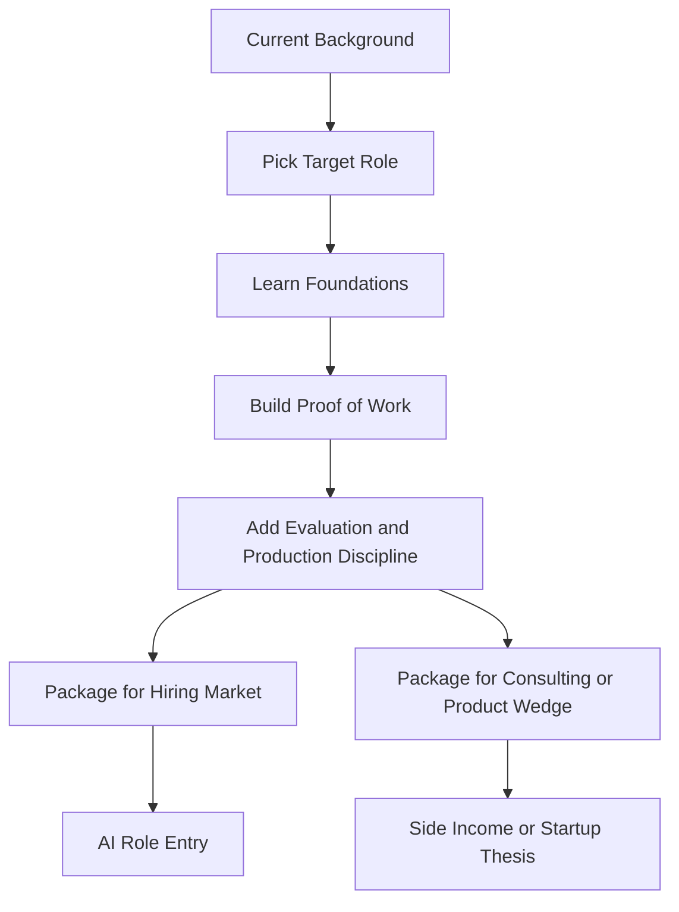

# AI Career Transition Roadmap

A deep, practical roadmap for people moving into AI from software, data, product, QA, design, operations, or non-technical roles. This repository focuses on what to learn, how to sequence it, and how to bridge the gap from your current experience to credible AI capability.

[](#)
[](#)
[](#)

## Overview

Most people trying to switch into AI face the same problem: they do not know where to start, what order to learn in, or which topics are essential versus optional.

This repository solves that by organizing the transition into a staged path:

```
    Current Role
         │
         ▼
  Assess transferable skills
         │
         ▼
  Learn core foundations
  - Python and data work
  - ML concepts
  - Deep learning
  - LLM applications
         │
         ▼
  Build projects and proof of work
         │
         ▼
  Add production and evaluation skills
         │
         ▼
  Reposition profile, resume, and interviews
         │
         ▼
      AI Role Entry
```

## What You Will Get From This Repo

By the end of this roadmap, you should be able to:

- choose a realistic AI target role based on your current background
- identify the technical gaps that actually matter for your transition
- follow a staged learning plan instead of studying topics in random order
- build proof-of-work projects that support resumes, portfolios, and interviews

You should also be able to:

- read market signals and avoid training for roles that are already being commoditized
- choose a domain where your background creates an unfair advantage
- build AI work that can become a job signal, a consulting wedge, or an early product

## What Makes This Repo Different

This is not a generic list of courses.

This repository is designed like an AI career operating system.

It combines four things most career roadmaps keep separate:

1. skill sequencing
2. portfolio proof
3. market positioning
4. creator and founder leverage

That means the goal is not only to help you learn AI.

The goal is to help you become economically useful with AI.

## Quick Navigation

| If You Need | Start Here | Then Continue With |
|-------------|------------|--------------------|
| role clarity | `modules/01_where_to_start.md` | `modules/04_role_based_bridge_paths.md` |
| a learning sequence | `modules/02_foundations_you_must_learn.md` | `modules/03_ml_dl_llm_roadmap.md` |
| project strategy | `modules/05_projects_portfolio_and_job_strategy.md` | `templates/project-case-study-template.md` |
| job-readiness assets | `modules/07_resume_portfolio_and_interview_bridge.md` | `modules/10_interview_question_banks.md` |
| staying relevant in a fast-moving market | `modules/11_future_proof_your_ai_career.md` | `modules/13_ai_side_hustles_and_monetization.md` |
| building trustworthy AI work | `modules/12_ai_ethics_evals_and_trust.md` | `references/research-backed-learning-resources.md` |

## Prerequisites

You do not need prior AI specialization to use this repository.

It helps if you already have:

- basic comfort with software tools such as Git, terminals, and online documentation
- a target role in mind, even if it is still rough
- willingness to build public proof of work instead of only consuming courses

## Recommended Next Repositories

After this roadmap, continue with:

- [prompt-engineering-foundations](https://github.com/dhirajkrsingh/prompt-engineering-foundations) for reliable prompting patterns
- [llm-evals-and-anti-hallucination](https://github.com/dhirajkrsingh/llm-evals-and-anti-hallucination) for evaluation and reliability thinking
- [cursor-ai-development-workflows](https://github.com/dhirajkrsingh/cursor-ai-development-workflows) for AI-assisted development workflows

## Who This Repo Is For

This repository is designed for:

1. Software engineers moving into AI engineering or applied ML.
2. Data analysts moving into data science, ML, or LLM application work.
3. Product managers trying to become AI product builders or technical AI PMs.
4. QA, DevOps, or platform engineers moving into MLOps, evaluation, or AI infrastructure.
5. Designers, domain experts, educators, and operations professionals who want to become effective AI builders or collaborators.

## Core Learning Model

The transition path is split into five layers.

| Layer | What You Learn | Why It Matters |
|-------|----------------|----------------|
| **1. Orientation** | What AI is, what it is not, and role options | Prevents wasted effort and confusion |
| **2. Technical Foundations** | Python, data handling, statistics, linear algebra basics | Gives you the minimum toolkit for understanding models |
| **3. ML and Deep Learning** | supervised learning, evaluation, neural nets, embeddings, transformers | Moves you from AI user to AI builder |
| **4. AI Product Building** | LLM apps, agents, prompt engineering, evals, deployment | Makes your work relevant to current hiring demand |
| **5. Career Bridge** | portfolio, proof of work, role positioning, interview stories | Converts learning into a job transition |

## Strategic Lens

Use this repo with three parallel lenses, not just one.

| Lens | Main Question | Why It Matters |
|------|---------------|----------------|
| **Builder Lens** | Can I build something useful and defend the design? | Required for technical credibility |
| **Operator Lens** | Can I make it reliable, measurable, and safe enough for real use? | Required for production trust |
| **Creator Lens** | Can I package this into visible market value? | Required for career leverage and opportunity creation |

## Career Engine Map



## How To Use This Repo Like A Serious Builder

1. Pick one target role, not three.
2. Pick one domain where you already understand users, data, or workflow pain.
3. Build one proof project that solves a painful problem in that domain.
4. Add evaluation, observability, and failure analysis.
5. Turn the project into a case study, a resume asset, and a market signal.
6. If the project has repeated demand, turn it into a consulting offer or product wedge.

## Repository Modules

| File | Description |
|------|-------------|
| `modules/01_where_to_start.md` | How to choose the right AI path based on your current role |
| `modules/02_foundations_you_must_learn.md` | Core technical topics and the minimum depth you actually need |
| `modules/03_ml_dl_llm_roadmap.md` | A sequenced roadmap from ML basics to modern LLM systems |
| `modules/04_role_based_bridge_paths.md` | Bridge plans for software, data, product, QA, ops, and non-tech backgrounds |
| `modules/05_projects_portfolio_and_job_strategy.md` | How to build proof of work that helps you switch roles |
| `modules/06_from_any_role_to_ai.md` | A role-to-AI bridge matrix for technical and non-technical transitions |
| `modules/07_resume_portfolio_and_interview_bridge.md` | How to reposition your experience for resumes, portfolios, and interviews |
| `modules/08_topic_map_by_target_role.md` | Which topics to learn deeply vs at working depth by target role |
| `modules/09_role_specific_project_ideas.md` | Project ideas mapped to AI Engineer, ML, Data, MLOps, PM, and evaluation roles |
| `modules/10_interview_question_banks.md` | Interview prep question banks for major AI target roles |
| `modules/11_future_proof_your_ai_career.md` | How to stay valuable as tools, models, and hiring patterns change |
| `modules/12_ai_ethics_evals_and_trust.md` | How to build AI systems that are measurable, trustworthy, and professionally defensible |
| `modules/13_ai_side_hustles_and_monetization.md` | How to convert AI skill into consulting, product, or creator leverage |
| `templates/90-day-transition-plan.md` | A reusable 90-day learning and execution plan |
| `templates/180-day-transition-plan.md` | A deeper plan for realistic career transitions |
| `templates/role-gap-assessment.md` | A worksheet for identifying your real transition gaps |
| `templates/project-case-study-template.md` | A template for strong portfolio and interview-ready project writeups |
| `templates/resume-bullets-and-linkedin-summaries.md` | Sample positioning patterns for resumes and LinkedIn summaries |
| `templates/ai-opportunity-thesis.md` | A template for turning skill into a niche offer, consulting wedge, or product direction |
| `checklists/ai-switch-readiness-checklist.md` | How to know if you are actually ready to apply |
| `checklists/first-ai-project-checklist.md` | A release gate for making your first AI project portfolio-worthy |
| `checklists/ai-offer-validation-checklist.md` | A filter for deciding whether a project can become a real offer or business wedge |
| `references/research-backed-learning-resources.md` | Curated external resources and why they matter |

## What To Learn First

If you are overwhelmed, start here.

### Stage 1: Understand The AI Landscape

Learn:

1. What machine learning is.
2. The difference between AI engineer, ML engineer, data scientist, MLOps engineer, AI product manager, and applied researcher.
3. What modern AI teams actually build.
4. What LLMs can and cannot do.

Why this comes first:

Without role clarity, people waste months studying the wrong material.

### Stage 2: Build The Technical Base

Learn:

1. Python for data and model workflows.
2. Data wrangling with tables, arrays, and notebooks.
3. Statistics basics: probability, distributions, sampling, evaluation metrics.
4. Linear algebra basics: vectors, matrices, dot products, embeddings intuition.
5. Git, terminals, environments, and reproducible workflows.

This is the minimum floor for serious AI work.

### Stage 3: Learn Machine Learning Properly

Learn:

1. Regression and classification.
2. Train/validation/test split.
3. Metrics such as accuracy, precision, recall, F1, ROC-AUC.
4. Overfitting, regularization, generalization.
5. Feature engineering and data quality.

This stage matters because a lot of weak AI transitions skip directly to LLM wrappers and never build modeling judgment.

### Stage 4: Learn Deep Learning And LLM Systems

Learn:

1. Neural networks and gradient descent intuition.
2. Embeddings and representation learning.
3. Transformers and token-based generation basics.
4. Prompt engineering and structured prompting.
5. Retrieval-augmented generation, agents, and tool use.
6. Evaluation, hallucination reduction, safety, and reliability.

### Stage 5: Learn AI Product And Production Thinking

Learn:

1. How to frame a problem so AI is the right tool.
2. Deployment basics.
3. Monitoring and feedback loops.
4. Experiment tracking and evaluation.
5. Cost, latency, privacy, safety, and user experience trade-offs.

This is where many candidates separate themselves from people who only did tutorials.

## Transition Advice By Starting Point

| Starting Role | Strong Transferable Skills | Biggest Gap To Close |
|---------------|----------------------------|----------------------|
| Software Engineer | coding, systems, debugging, delivery | ML intuition, data thinking, evaluation |
| Data Analyst | SQL, dashboards, metrics, data sense | production engineering, modeling depth |
| QA Engineer | test design, failure analysis, edge cases | model building and data workflows |
| DevOps / Platform | infra, deployment, observability | ML modeling and experimentation |
| Product Manager | problem framing, prioritization, user value | technical implementation and evaluation depth |
| Designer / UX | user journeys, interaction design | technical literacy and AI systems behavior |
| Non-Technical Domain Expert | domain knowledge, business context | technical fundamentals and proof of build ability |

## Opportunity Selection Rule

The best AI transition path is usually not:

- learn everything
- copy generic chatbot demos
- apply everywhere

The best path is usually:

1. choose one target role
2. choose one domain pain point
3. build one measurable workflow improvement
4. publish one strong case study
5. repeat inside the same niche until you become believable

This rule matters because careers and businesses are both built on repeated credibility, not scattered experimentation.

## Best Practices For A Successful Switch

1. Do not learn only theory. Build visible projects.
2. Do not learn only prompting. Learn data, evaluation, and production basics too.
3. Use your current background as leverage instead of discarding it.
4. Pick one target role first and optimize for that role.
5. Build a portfolio around a domain or workflow you understand well.
6. Learn to explain trade-offs, not just use tools.
7. Show that you can evaluate and improve AI systems, not only call APIs.
8. Follow the market, but do not blindly chase hype.
9. Learn the layers that survive tool changes: problem framing, evaluation, system design, and user value.
10. Build assets that can compound: projects, writing, templates, demos, and domain trust.

## Recommended Execution Tracks

Choose the track that best matches your ambition.

### Track 1: Job Switcher

Best for:

- people targeting AI engineer, ML engineer, MLOps, or AI PM roles

Focus:

1. target role clarity
2. 2-3 strong portfolio projects
3. resume, GitHub, and interview packaging

### Track 2: Domain Specialist Turned AI Builder

Best for:

- healthcare, finance, education, legal, ops, support, or internal tooling professionals

Focus:

1. domain-specific assistant or workflow tool
2. evaluation around real task quality
3. credibility inside one niche

### Track 3: Creator Or Entrepreneur

Best for:

- people who want consulting, freelance income, or an early-stage product direction

Focus:

1. one painful workflow with clear ROI
2. one narrow offer
3. public proof, audience trust, and iterative distribution

## Research Themes Behind This Repo

This repository is informed by widely used public learning paths:

1. Google ML Crash Course emphasizes practical ML fundamentals, data handling, overfitting, neural networks, embeddings, LLM basics, and production systems.
2. fast.ai emphasizes learning through building, with some coding skill as the main prerequisite rather than deep mathematical specialization.
3. Full Stack Deep Learning emphasizes the full product lifecycle: tooling, testing, data, deployment, monitoring, LLMOps, and AI product development.
4. Hugging Face Learn provides applied tracks for LLMs, agents, reinforcement learning, and open-source AI ecosystems.
5. DeepLearning.AI's AI for Everyone highlights realistic role awareness, team workflows, and what AI can and cannot do.
6. roadmap.sh's AI Engineer path reflects the modern tooling stack around models, prompting, RAG, agents, safety, and product impact.
7. Applied AI programs and product-oriented curricula increasingly emphasize business framing, model evaluation, multimodal workflows, and production quality rather than toy demos.
8. Strong open-source communities show that documentation, clear contribution paths, and public discussion spaces improve retention, trust, and repeat contribution.

## Position In The Portfolio

This is the entry-point repository for career switchers.

Use it first if your main question is not "how do I build an agent?" but rather "how do I become credible enough to work in AI?"

Use the later modules if your next question becomes one of these:

- how do I avoid becoming obsolete as tools improve?
- how do I make my AI work trustworthy enough for real adoption?
- how do I turn my learning into income, leverage, or a startup wedge?

## Author

Dhiraj Singh

## Usage Notice

This repository is shared publicly for learning and reference.
It is made available for everyone through [VAIU Research Lab](https://vaiu.ai/Research_Lab).
For reuse, redistribution, adaptation, or collaboration, contact Dhiraj Singh / [VAIU Research Lab](https://vaiu.ai/Research_Lab).